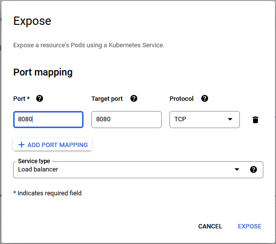

# cs1660-term-project

## 1) Getting the images on GKE

1. pull all the images onto gcp
    * e.g. "docker pull pob6/driver"
2. tag all the images with the gcp repo you wish to use and the project ID
    * e.g. "docker tag pob6/driver us.gcr.io/PROJECT_ID/pob6/driver"
3. No we can push the images onto the gcp remote repository
    * e.g. "docker push us.gcr.io/PROJECT_ID/pob6/driver"
4. After all the images are pushed go to the kubernetes engine

## 2) Creating the deployments on the cluster

1. Create a new deployment
2. Create a container for each of the images using the "select from preexisting image option"

### a) Spark deployment
1. Start by naming your deployment <spark_master_name> using the spark image
2. Set the environment variables for your spark master node

> `SPARK_MODE=master`
> `SPARK_RPC_AUTHENTICATION_ENABLED=no`
> `SPARK_RPC_ENCRYPTION_ENABLED=no`  
> `SPARK_LOCAL_STORAGE_ENCRYPTION_ENABLED=no`  
> `SPARK_SSL_ENABLED=no`  

3. Next hit the deploy button
4. After it is deployed navigate to the workloads tab and select <spark_master_name>
5. Click expose and set the fields to: 8080 8080

6. After this the frontend is now accessible at the ip specified on the services tab under <spark_master_name>
7. Now click the actions tab and `expose`, set the `port` field to 7077 and the `target port` field to 7077. Change the service type to `Cluster IP` and click expose.
8. Check the workload for the `Cluster IP` <spark_master_ip> and make a note of it.

9. Make another deployment <spark_worker_name> using the spark image
10. Set the environment variables for you spark worker node

> SPARK_MODE=worker
> SPARK_MASTER_URL=<spark_master_ip>:7077
> SPARK_WORKER_MEMORY=1G
> SPARK_WORKER_CORES=1
> SPARK_RPC_AUTHENTICATION_ENABLED=no
> SPARK_RPC_ENCRYPTION_ENABLED=no
> SPARK_LOCAL_STORAGE_ENCRYPTION_ENABLED=no
> SPARK_SSL_ENABLED=no

11. Create the deployment by hitting the "Deploy" button

### b) Jupyter Notebook

1. Start by naming your deployment <jupyter_name> using the jupyter notebook image
2. Click the deploy button
3. Navigate to the workloads section
4. Click `actions` and `expose`. Set the `port` and `target port` fields to 8888 and set the `service type` to Load Balancer.
5. Navigate to the logs for the workload and find the 
